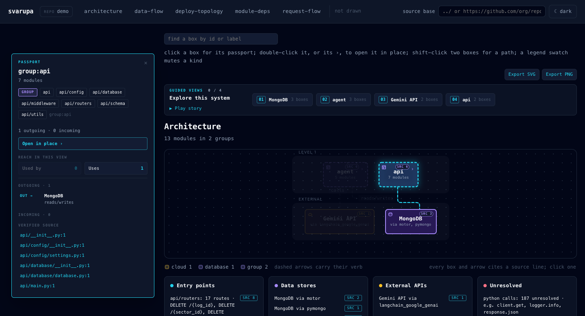

# Svarupa

**स्वरूप** — *"its own true form."*

Svarupa reads a codebase and produces a **verified** map of it: a queryable
knowledge graph plus six types of architecture diagram (architecture, module
dependencies, data flow, request flow, deploy topology, ERD), delivered as one
interactive HTML artifact. A type the evidence cannot produce is named as
absent, never fabricated.

The defining constraint: **every node and every edge in every diagram carries
`file:line` evidence, or it does not render.** Not a heuristic guess, not a
model's plausible story. A claim you can click through to the source line that
proves it.

The name states the thesis. Svarupa is a thing's actual form, not its intended
one. Architecture documents describe what someone meant to build. Svarupa
renders what exists.

> **Status: pre-alpha, under active development.** Nothing here is stable yet.

---

## Usage

```bash
uv tool install <path to this checkout>   # `uv tool install svarupa` once published
svarupa <path to a repository>            # writes <path>/.svarupa/
svarupa <path> --out ./map                # or anywhere else
open ./map/index.html
```

`python -m svarupa` is the same command. The artifact holds:

- `index.html`: every diagram type as a tab. Click a box for its passport
  (kind, connections, reach, cited source lines); double-click a drillable box,
  or click its chevron, to open it in place down to component and code level.
- `graph.json`: the knowledge graph. `svarupa query <dir> get_node <label>`,
  `get_neighbors`, `shortest_path`, `affected`, `god_nodes`, `graph_stats`,
  `query_graph`; `svarupa mcp <dir>` serves the same over MCP.
- `REPORT.md`: the resolution scorecard and every finding, with its code.
- `--lock` writes the committed architecture lockfile; `--diff` prints the
  architecture delta against a base lockfile. `svarupa setup ci_github`
  installs the per-pull-request workflow.



---

## Why

Every tool in this space sits on one side of a divide and cannot cross it.

| Tool | Analyzes code | Draws formal diagrams |
|---|---|---|
| Graphify | Deeply, 25+ languages | No — force-directed node-link graphs only |
| Understand-Anything | Yes, AST + LLM | No — force layouts only |
| Archify | No — reads nothing | Yes, five types, excellent quality |
| Cocoon-AI | No — prompt-to-diagram | Yes, architecture only |

Nobody closes the loop `code → AST → derived formal diagram`. The analyzers
produce blobs; the drawers produce unverifiable pictures.

### The larger thesis: continuous architecture governance

Graphify and Understand-Anything are *onboarding* tools. You run one when you
join a project, look at the graph, and never open it again.

Because Svarupa's output is deterministic and evidence-backed, it runs in CI on
every pull request: diff the architecture, comment the impact, fail the build
on policy violations. **Cross-language architecture linting is a category
nobody occupies.**

```
Architecture impact of #482

  + 2 components    billing.refunds, billing.webhooks
  + 1 datastore     redis (compose.yml:31)
  ! NEW DEPENDENCY  billing -> auth.internal
                    via billing/refunds.py:44
  + 4 endpoints     POST /refunds, GET /refunds/{id}, ...
```

---

## Design principles

**Fail-closed on evidence.** An element without a source location is not
emitted. When Python's dynamic dispatch means a call target cannot be pinned,
no edge is written and the gap is counted in the report, rather than papered
over with a plausible one.

**Three-bin honesty.** The resolution scorecard reports *resolved*,
*known-external*, and **unresolved-unknown**. Counting every failure as
"external" would launder resolver bugs into a number that looks like honesty.

**Deterministic by contract.** Same commit, same bytes, on any machine.
Canonical ordering, `==`-pinned grammars, NFC-normalized paths, no timestamps,
no locale-dependent formatting. Verified in CI across Linux and macOS on Python
3.10 through 3.13 with `PYTHONHASHSEED` varied.

**Identity comes from structure, not from clustering.** Lockfile modules are
directories, packages, and workspace members. Community detection is
chaotically sensitive to input perturbation — measured: one added import flips
25-38% of community assignments — so it is used for visual grouping only and
never reaches anything committed.

**Measured, not assumed.** Function-level sequence diagrams were cut after
measurement showed call resolution at ~20% on service code with median chain
depth 0-1. See `docs/reviews/` for the numbers and the reasoning.

---

## Development

```bash
uv sync
uv run pytest
uv run ruff check svarupa
uv run pyright svarupa
```

Design and review history:

- `docs/superpowers/specs/` — the design, with a decision log carrying the
  reasoning behind each choice
- `docs/reviews/` — adversarial reviews, raw and triaged. Every finding is
  marked Accepted, Rejected, or Deferred **with a recorded why**, because a
  rejected finding needs its reasoning kept just as much as an accepted one

---

## License

AGPL-3.0-or-later, **provisionally**. This is under active reconsideration: the
CI use case targets platform teams at companies, which is the demographic most
likely to ban AGPL outright. See the design's open items.
